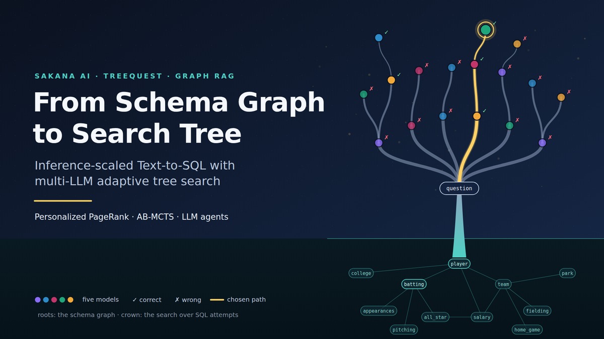
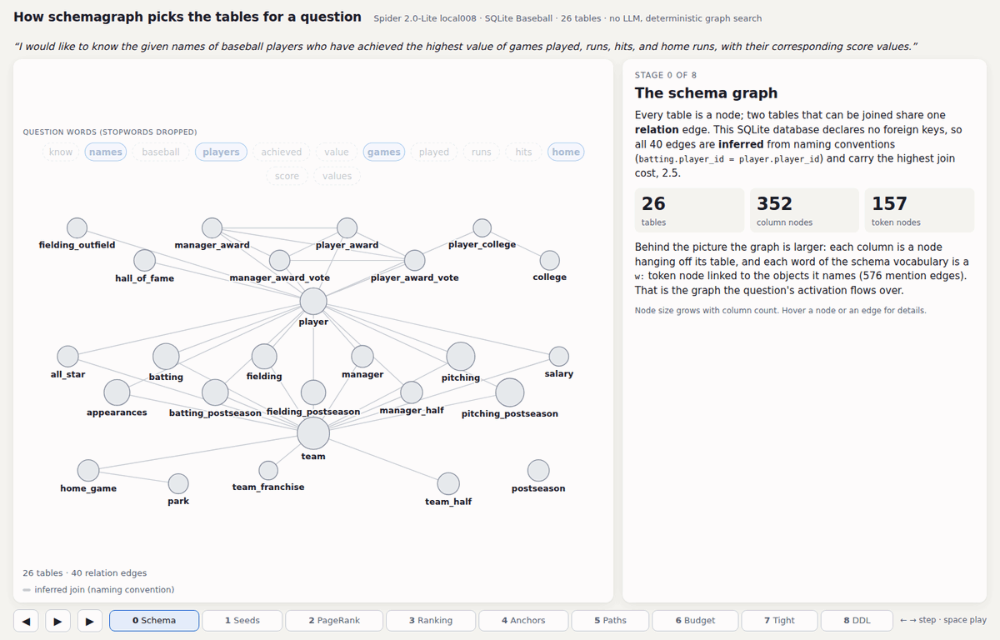
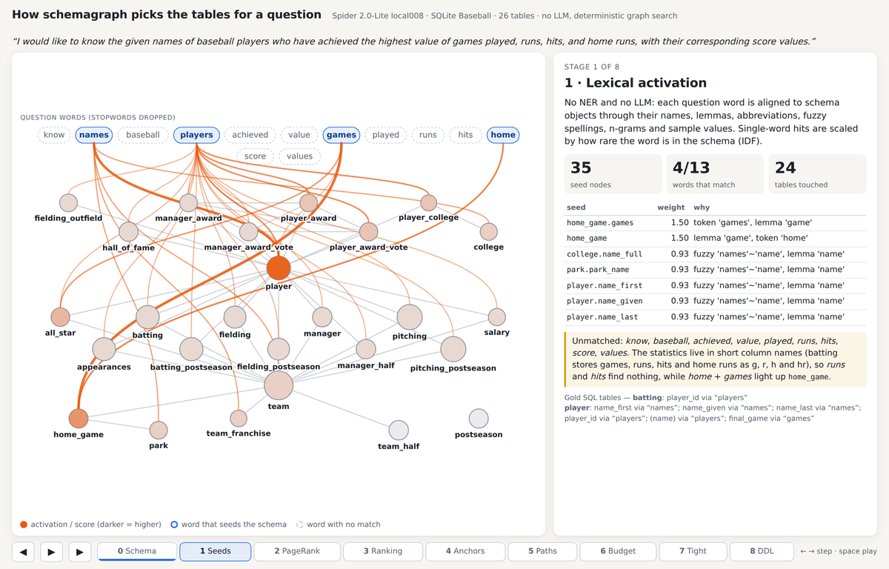
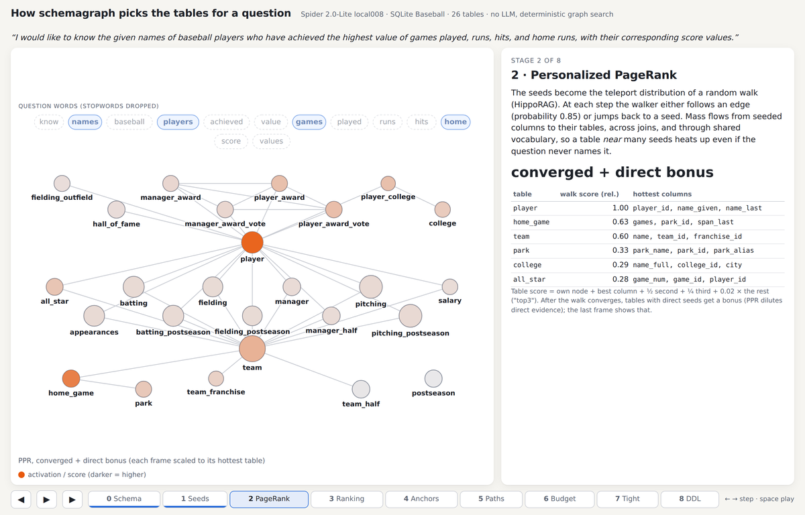
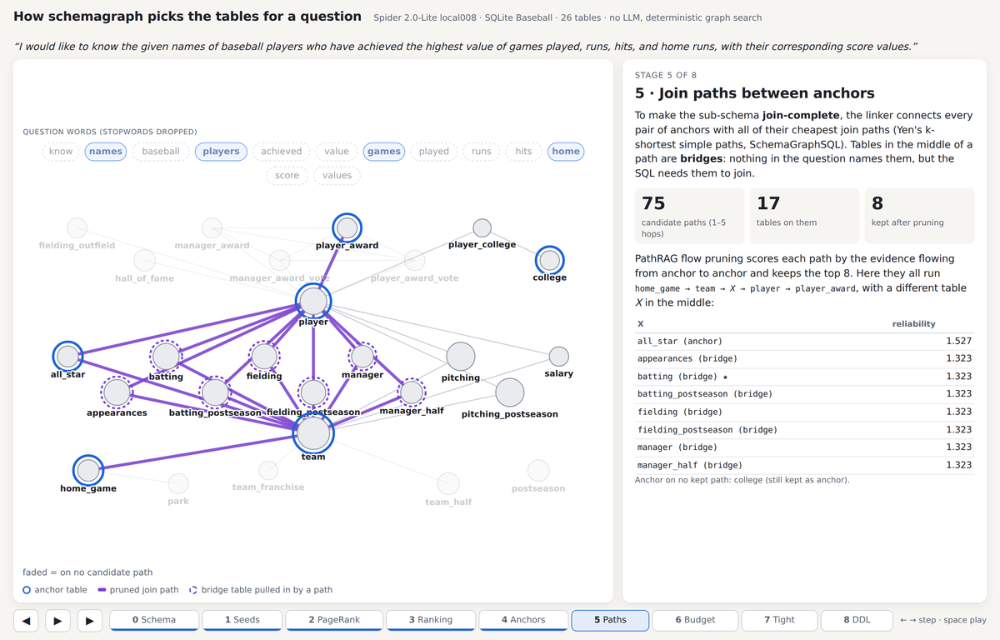
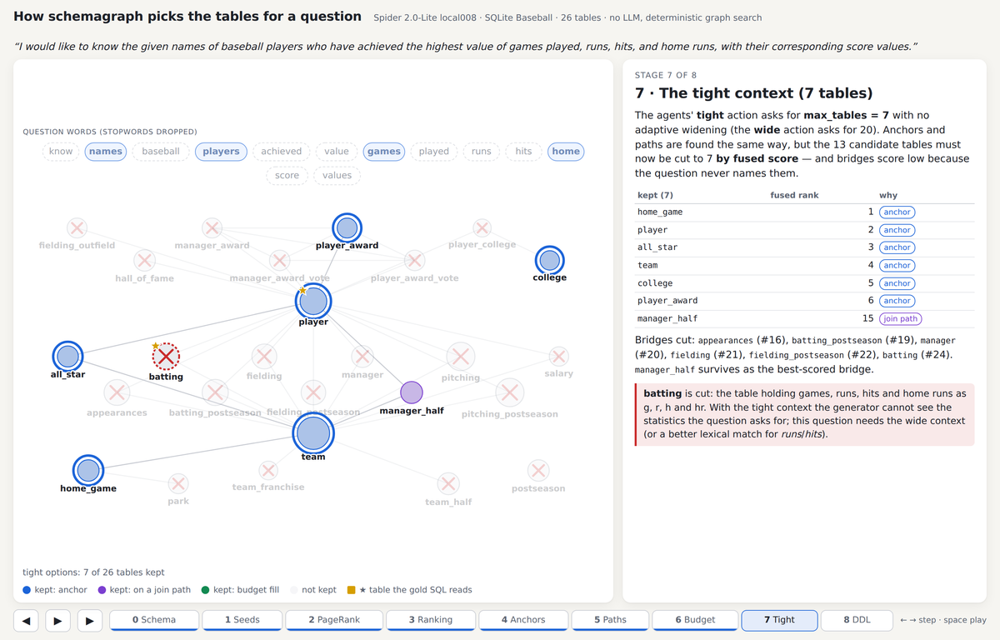
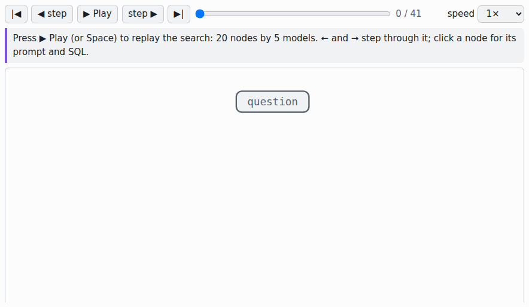
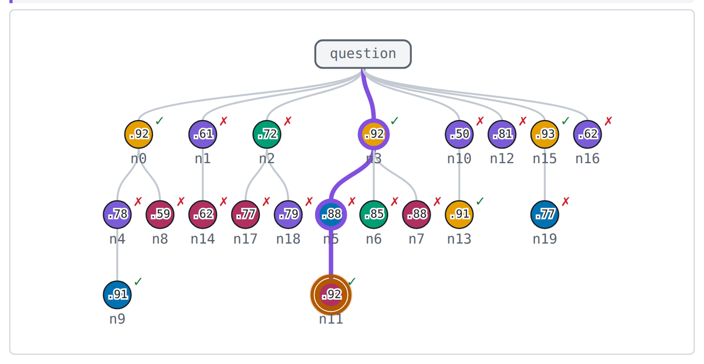
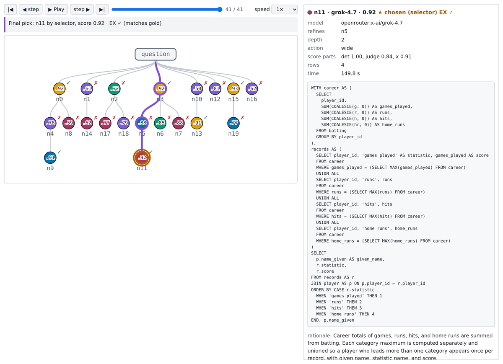

# schemagraph

Graph-native schema context engine for text-to-SQL.



Catalog metadata in — pasted DDL, DuckDB, dbt projects, **Unity Catalog**, **AWS Glue**, **Collibra** — one provenance-tagged schema graph in the middle, and a linked, join-complete sub-schema out, rendered as annotated DDL an LLM can write SQL against. Served over HTTP and MCP, fed and curated through a small web UI.

The linking core is graph search, not embedding search:

* **LinearRAG**-style entity activation from the question (tokens, n-grams, abbreviations, glossary phrases, sample values) — no LLM, no vectors.
* **HippoRAG** personalized PageRank over tables, columns, terms and tokens to rank candidate tables.
* **SchemaGraphSQL** union of shortest paths between anchor tables, so bridge tables are included by construction.
* **PathRAG** flow-based pruning of redundant join paths, serialized most-reliable-last.
* Optional one-call **Claude** pass to pick source/destination tables when you want it.

Design notes: [`docs/DESIGN.md`](docs/DESIGN.md); how schema objects become the lexical entities and query seeds the linker ranks: [`docs/ENTITIES.md`](docs/ENTITIES.md); what bounds and gates every query the agent runs: [`docs/QUERY_COST.md`](docs/QUERY_COST.md).

## See it work

One Spider 2.0-Lite task tells the whole story: `local008` over the SQLite Baseball database — *"I would like to know the given names of baseball players who have achieved the highest value of games played, runs, hits, and home runs, with their corresponding score values."* — linked deterministically, then answered by a real 20-node AB-MCTS search with five generator models ($1.33, 15 minutes, the pick matching gold). Every picture below is that one task: in the benchmark checkout, where these sources live out of git, `bench_results/link_viz/make_link_animation.py` regenerates the linking walk with its real intermediate numbers, and `schemagraph viz-search` regenerates the replay page from the run's saved candidates, no model call.

The linker stage by stage — the schema graph, the lexical seeds, personalized PageRank, the fused ranking, the anchors, the join paths, the budget, the tight cut and the final DDL:



* **Seeds.** Question tokens, n-grams, glossary phrases and sample values activate tables and columns — every hit carries its reason; no LLM, no vectors.
  
* **PageRank.** HippoRAG-style PPR spreads the seed mass over the graph; node specificity keeps generic columns from drowning the tables.
  
* **Join paths.** Between the evidence-gated anchors, the union of weighted shortest paths pulls the bridge tables in by construction.
  
* **The tight cut.** The budget applied: what survives is the linked, join-complete sub-schema, rendered as the annotated DDL the agents write SQL against.
  

The optional `agent` extra then searches SQL attempts over that context, and `--viz` writes the search as a replay page — here the real five-model run over the same task, stepped through all 41 of its events: AB-MCTS selects a path down the tree, starts a child with one of the models (node colour = LLM family), the child's score comes back up, and the final pick is ringed at the end:



The finished tree, and the same tree with the chosen node's side panel open — its score parts, its SQL and the rationale behind it (plus, further down the panel, the rubric, findings and critic advice on the nodes that have them):





## Quick start

```bash
uv sync --all-extras                # Python 3.11+
uv run schemagraph add-ddl examples/store.sql --dialect postgres --schema public
uv run schemagraph link "total revenue by product category for customers in california"
uv run schemagraph serve            # http://127.0.0.1:8765  (UI + API)
```

Build the UI once (served by `serve` from `web/dist`):

```bash
cd web && npm install && npm run build
```

Dev loop for the UI: `npm run dev` (proxies `/api` to port 8765).

## Connect a catalog

From the UI (**Connections**), or the CLI:

```bash
# Unity Catalog (Databricks or OSS server)
uv run schemagraph add unity_catalog prod -c '{"host":"https://adb-123.azuredatabricks.net","token":"${DATABRICKS_TOKEN}","catalogs":["sales"],"lineage":true}'

# AWS Glue
uv run schemagraph add aws_glue lake -c '{"region":"eu-west-1","databases":["lake"],"profile":"prod"}'

# Collibra (asset-type / relation-role names are configurable per operating model)
uv run schemagraph add collibra gov -c '{"host":"https://acme.collibra.com","username":"svc","password":"${COLLIBRA_PASSWORD}"}'

# dbt project, parsed without dbt installed
uv run schemagraph add-dbt --project-dir ~/analytics --name dbt
```

Every table, edge and glossary term remembers which source it came from, and sources merge: Glue gives you columns, dbt gives you lineage and `relationships` tests, Collibra gives you curated relations, descriptions, classifications and business terms, and you can add join hints and glossary entries by hand.

## Use it from an agent

```bash
uv run schemagraph mcp                    # stdio MCP server: link_schema, get_table, find_join_path, ...
uv run schemagraph mcp --transport http   # the same tools over streamable HTTP at http://127.0.0.1:8766/mcp
```

`schemagraph serve` also serves the MCP server at `http://127.0.0.1:8765/mcp`, over the same graph as the API and UI. The tools are read-only and never execute SQL. Or `POST /api/link {"question": "..."}` and paste the returned `ddl` into your prompt.

## Answer questions (optional)

```bash
uv sync --extra agent
export DASHSCOPE_API_KEY=...        # Qwen generator + critic (alibaba:qwen3.8-max)
export TYPESAFE_API_KEY=...         # Jev judge + selector (typesafe:jev-1.13.0)
uv run schemagraph add-duckdb shop.duckdb -n shop
uv run schemagraph ask "revenue by product category for customers in california" -c shop --strategy abmcts --budget 16
# uv run schemagraph ask "..." -c shop --spec    # plan first: one planner call specs the question
```

Or both models through one OpenRouter key: copy `.env.example` to `.env`, fill in the key, and run with `uv run --env-file .env schemagraph ask ...`. `openrouter:` models reason at `SCHEMAGRAPH_REASONING` effort (`off | low | medium | high`, default `medium`; forced tool choice is off while they reason), the optional `--spec` planner defaults to an `openrouter:` model on the same key and reasons at its own `SCHEMAGRAPH_PLANNER_REASONING` (default `high`), and Jev reaches OpenRouter's TypeSafe-compatible endpoint through `TYPESAFE_BASE_URL=https://openrouter.ai/api`.

`ask` reads the schema through schemagraph's own MCP server, writes SQL with Qwen, runs it **read-only** against the DuckDB or SQLite file (`--db` takes either; guard + engine statement check + hardened connection, timeout and row caps), **bounds every query it runs with a `LIMIT` in the SQL text and gates it on an `EXPLAIN` cost estimate that refuses a catastrophic plan unrun** — the refusal scores like any other execution failure and feeds the refinement (thresholds, calibration and what stays timeout-bound: [`docs/QUERY_COST.md`](docs/QUERY_COST.md)) — scores each candidate with deterministic checks and a Jev rubric, and searches with TreeQuest AB-MCTS (`--strategy best_of_n | refine | single` for the baselines). Repeat `--gen-model` and the models become the search's actions instead of the context width — Multi-LLM AB-MCTS (arXiv [2503.04412](https://arxiv.org/abs/2503.04412), appendix D): every node then links the wide context with its own model, which is what the per-family colours in the replay above draw; `single` and `refine` keep the first model. Any pydantic-ai model string works per role via `SCHEMAGRAPH_GEN_MODEL`, `SCHEMAGRAPH_JUDGE_MODEL`, `SCHEMAGRAPH_CRITIC_MODEL`. Cost scales with `--budget` (generator nodes). Every usage record carries the billed cost in USD (OpenRouter's reported cost per response, failed and retried requests included; Jev at its published $0.042 per million input tokens when the response has no cost), reasoning and cache tokens; `ask` prints it per role and `bench-spider2-exec` summarises it per task (mean, p50, p90, max, total).

`--spec` puts one planning call in front of the search: the planner (`--planner-model`, default `SCHEMAGRAPH_PLANNER_MODEL` = `openrouter:anthropic/claude-opus-5.5`, reasoning at `SCHEMAGRAPH_PLANNER_REASONING`, default `high`) reads the question and the linked wide context and writes a specification — the main reading, the output columns, the alternative readings — that the generator, the critic, the judge (as a `follows_spec` rubric field) and the selector all read; `ask --json` carries it as `spec` and the replay page folds it under the facts. It is off by default, both flags are on `bench-spider2-exec` too, and a failed planner call never fails the answer: the search then runs as if the planner were not there.

By default `ask` serves this home's schema, scoped to the connection, on an ephemeral localhost port for the length of the call. `--mcp-url http://127.0.0.1:8765/mcp` points the agents at a running server instead (`serve`'s `/mcp`, or `mcp --transport http`); that server is not scoped, so `-c` then only picks the database the SQL runs on. The generator gets the server's `link_schema`, `search_tables`, `get_table`, `find_join_path` and `list_glossary` tools; `sample_values` and `run_query`, the two that execute, stay local to the agent.

`--viz tree.html` also writes the search as a standalone HTML replay page: the search tree drawn top-down, each node under the one it refines and coloured by its generator's LLM family (qwen, glm, gemini, gpt, claude, ...; shades tell models of one family apart), with a player that steps through the search as it happened. Each step shows AB-MCTS selecting a path down the tree and starting a child with a model, then the child's score coming back up. The chosen node is ringed at the end, and failed and exec-error nodes are marked. A side panel shows each node's SQL, generator prompt (linking to the schema DDL, written once per page; a node still generating shows only its prompt), rubric, findings, feedback and critic advice. Play/pause, step, a scrubber, speeds and the keyboard (Space, ←, →) drive it, and without script the page still shows the final tree and every node. To replay the search, every candidate now records its generator prompt (with the schema DDL replaced by a marker) and when it was asked and told, and the answer keeps each schema DDL once (`contexts`) with the generator's instructions, so `ask --json` output carries those fields too. The path is checked before the search spends anything. For a benchmark run, `schemagraph viz-search bench_results/spider2_exec_<tag>_candidates.jsonl` draws the same page per task, plus an index, from the saved candidates (with each node's EX against the gold result), with no model call (pictured in § See it work).

## Layout

```
src/schemagraph/
  model.py          Table / Column / Edge / BusinessTerm / SchemaSnapshot / LinkResult
  connectors/       ddl, duckdb, dbt, unity, glue, collibra
  graph/            build (merge), pathfinding (SchemaGraphSQL), ppr (HippoRAG), pruning (PathRAG)
  linking/          lexical (LinearRAG activation), linker (pipeline), render (DDL)
  llm/anchors.py    optional Claude anchor-table pass
  store.py          DuckDB persistence   engine.py  the one object everything drives
  mcp/              MCP server over a SchemaSource (Engine, LinkerSource, ScopedSource); stdio or streamable HTTP
  agent/            optional: bounded, cost-gated read-only execution, checks, spec planner, Qwen/Jev agents, TreeQuest search (`ask`)
  api/  cli.py      FastAPI (with MCP at /mcp) and Typer
  bench/            Spider 2.0 / Spider benchmarks, execution accuracy and the judge study
web/                Vite + React UI
tests/              no network (catalog connectors run against canned payloads, agents against scripted models)
```

## Benchmark

```bash
uv run schemagraph bench-spider2-lite /path/to/Spider2   # gold-table recall on 547 Spider 2.0-Lite tasks, no LLM
```

2026-09-03, defaults: **95.3% strict table recall, 97.8% recall, 11.8 tables returned, ~17 ms/question**; 88.0% strict on schemas with 100+ tables. Details, ablations and the iteration log in [`bench_results/README.md`](bench_results/README.md).

## Status

v1. No writes and no governance by design — the agent calling `link_schema` owns that boundary; SQL runs only in the optional `ask` loop: read-only, LIMIT-bounded and cost-gated. Catalog connectors are written against the documented Unity Catalog 2.1, Glue and Collibra 2.0 APIs and tested with recorded payloads; run **check** on a real connection before trusting a build.
